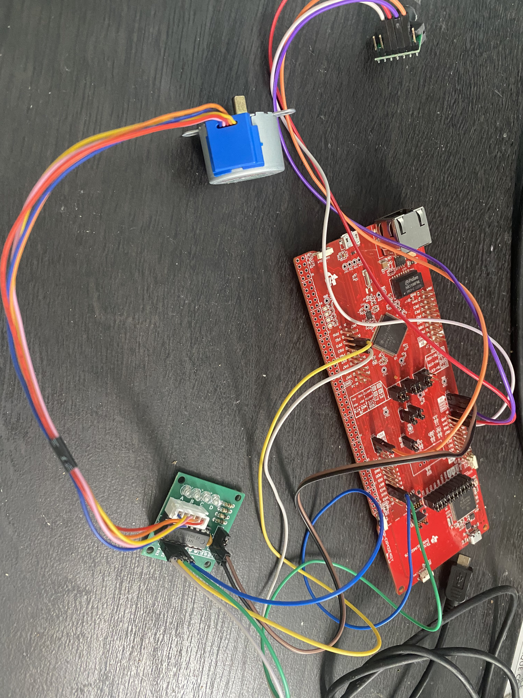
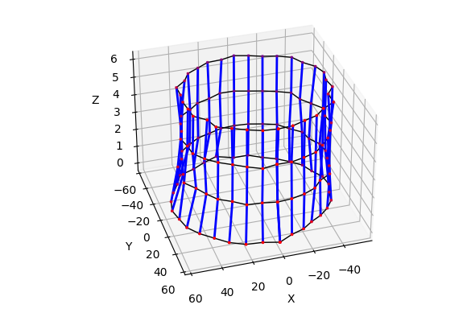
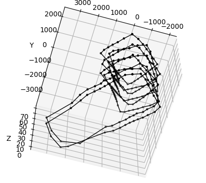
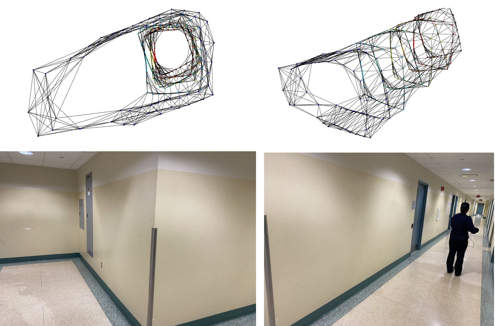

# 3D Spatial Simulation Mapping using ToF Sensors

## Introduction
This project is aims to map a real life, 3 dimensional room into a interactable simulation throuhg the use of computer hardware and software. The simulation is done in Python using the Matplotlib library and the data is collected using Time of Flight (ToF) sensors with the MSP-EXP432E401Y microcontroller. 

## Hardware
The hardware used in this project is the MSP-EXP432E401Y microcontroller, the VL53L0X Time-of-Flight Distance Sensor, and the 28BYJ-48 Stepper Motor. Connecting the stepper motor to its driver and the driver to the microcontroller is done using the following pinout:

| Stepper Motor Pin | Micro Pin  |
|-------------------|------------|
| IN1               | PH0        |
| IN2               | PH1        |
| IN3               | PH2        |
| IN4               | PH3        |

The VL53L0X sensor is connected to the microcontroller using the following pinout:

| Sensor Pin        | Micro Pin  |
|-------------------|------------|
| SDA               | PB2        |
| SCL               | PB3        |

Refer to the following image for any clarifications:



## Software

The software used in this project is Python 3.7.7 and the Matplotlib library. The code is written in Python and is used to collect data from the sensors and plot the data in a 3D simulation. The following dependencies are required to run the code and can be installed with the following command:

```bash
pip install matplotlib pyserial
```

Additionally, if you would like to run it with open3D, ensure you are running a suitable version such as Python 3.7.7 and install using:

```bash
pip install open3d
```

It is perfered to run the code in an editor that supports Python, such as Visual Studio Code, however, you can achieve similar results by running the code in the command line with the command `python Software Config/room_scan.py`.

## Configuration

To adjust the number of scans, you must change both the C++ and the Python files. In the C++ file, change the value of `num_scans` to the desired number of scans. In the Python file, change the value of `num_scans` to the same value as the C++ file. Note, in order to achieve an odd number of scans, you will need to add code to spin 1 additional time after the loop and scan these inputs into python.


## Usage

Once everything is set up and installed, load the C++ code onto the microcontroller and run the Python code. The microcontroller will scan the room and send the data to the Python code, which will then plot the data in a 3D simulation. The simulation can be interacted with using the mouse and keyboard. The mouse can be used to rotate the simulation and the keyboard can be used to move the simulation. 

## How it Works

The microcontroller is connected to the ToF sensor and the stepper motor. Using half-stepping, the stepper motor is rotated 360 degrees at 11.25 degrees with 32 steps. The ToF sensor is connected to the motor and spun around allowing it to measure the distance at each step. Using the I2C communication protocol, the data is then sent to the microcontroller where it is then sent to the python script via UART communication. With the distance data and the number of points (used to determine the current angle), we can turn the data into a tuple of x, y, z coordinates. We can plot these coordinates in a 3D simulation using the Matplotlib library.


## Results

4 Layer scan of a container



8 Layer scan of a hallway with Matplotlib



8 Layer scan of a hallway with Open3d




